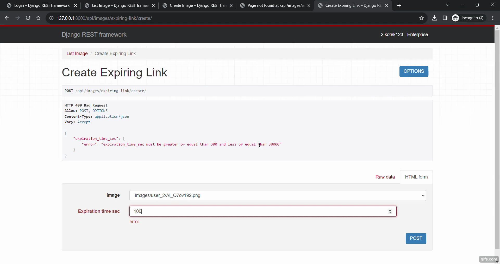

# file_uploader
 DRF API for uploading and listing PNG and JPG images according to user account tier

## Table of Contents

1. [Introduction](#introduction)
2. [Prerequisites](#prerequisites)
3. [Setting Up](#setting-up)
   - [Testing](#testing)
4. [API Endpoints](#api-endpoints)
5. [Performance Optimization](#performance-optimization)
   - [Using Dropbox for Storage](#using-dropbox-for-storage)
   - [Redis Caching](#redis-caching)
   - [Sorl Thumbnail Caching](#sorl-thumbnail-caching)
6. [Live Preview](#live-preview)

## Prerequisites

- Python 3.10.*
- Docker 20.10.17
- Redis 7.2.1

## Setting Up

To set up and run the API using Docker, follow these steps:

1. Clone the repository:

   ```
   git clone https://github.com/aleksandragoryczka/file_uploader
   ```
   
2. Navigate to the project directory:

   ```
   cd file_uploader
   ```
3. Create and activate virtual environment:

   ```
   python -m venv .venv
   ```
   - On Windows:
     ```
     .venv/Scripts/activate
     ```
   - On macOS and Linux:
     ```
     source ./venv/bin/activate
     ```
   
4. Build and run Docker containers:
   ```
   docker-compose build
   ```
   ```
   docker-compose up web redis
   ```
   
5. Access the API endpoints at `http://127.0.0.1:8000`

### Testing
    
Run tests wtih command:
   ```
   docker-compose up tests
   ```

## API endpoints

The following endpoints are available:

- [/admin](http://127.0.0.1:8000/admin/) - Log in to Admin panel with default credentials (username: admin, password: admin) for further managing user Accounts
- [/api/accounts/dj-rest-auth/login](http://127.0.0.1:8000/api/accounts/dj-rest-auth/login/) - Login to user account
- [/api/images/](http://127.0.0.1:8000/api/images/) - List user images with details depends on user Account Tier
- [/api/images/create/](http://127.0.0.1:8000/api/images/create/) - Upload image
- [/api/images/expiring-link/int:image_id](http://127.0.0.1:8000/api/images/expiring-link/) - Get expiring link with details for image
- [/api/images/expiring-link/create/](http://127.0.0.1:8000/api/images/expiring-link/create/) - Create new expiring link

## Performance Optimization

### Using Dropbox for Storage

I decided for storing files on Dropbox storage. Mainly because there is no need for passing credit cad details while creating account ;)
In the future, I would for sure consider using more scalable solutions like Azure Storage, GCP or AWS.

### Redis Caching

Redis is used for caching to improve API response times. The example of shortening response time is in below Live preview when I tried to list images few times in a row.

### Sorl Thumbnail Caching

I use Sorl Thumbnail to generate and cache image thumbnails.

## Live Preview




